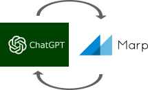
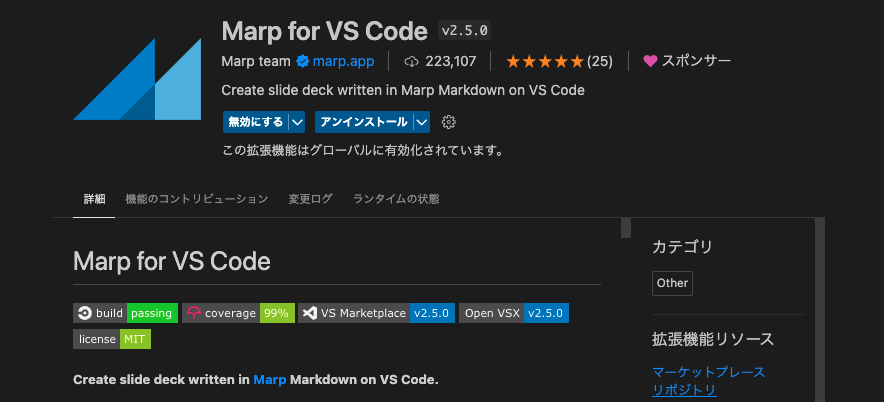
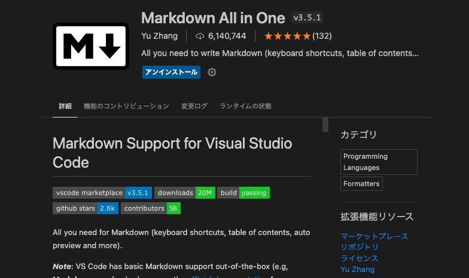
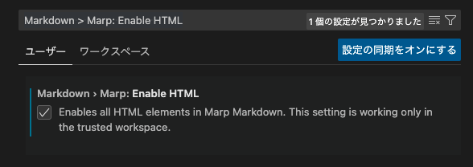
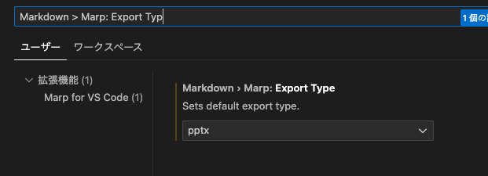
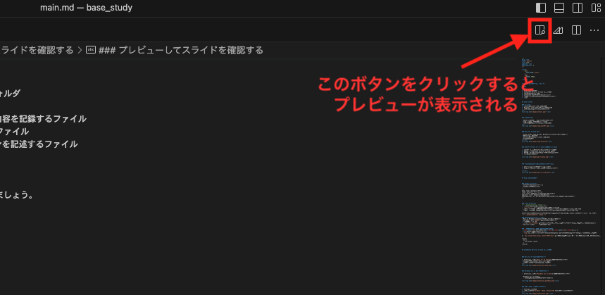
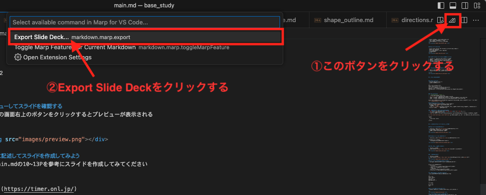

<style> 
    div {
      text-align: center;
    }
    .default {
      width: 450px;
    }
    .wide {
      width: 700px
    }
    .more-wide {
      width: 900px
    }
</style>


# <div>chatGPT で作成するプレゼン資料</div>

# <div>スライド作るのってめんどくさくないですか？</div>

# 
#### 構成パターンがわからない
#### デザインにこだわってしまい作業が進まない
#### 作っている最中に別のアイデアが浮かび最初から作り直してしまう
#### 伝えたいことがまとまらない

# <div>ChatGPTに任せましょう！</div>

# 本日のゴール
<br><br>
<div style="font-size: 36px" ><b>ChatGPTを活用してスライドを作成できるようになる</b></div>

### この勉強会で身に付くこと
- Marpを使ってスライドの作成及び編集ができるようになる
- プロンプトエンジニアリングの基礎が理解できるようになる

# 目次

1. 全体像の紹介
2. Marp の文法について
3. ハンズオン Marp for VS Code を使ってみる
4. ChatGPTと組み合わせる
5. ハンズオン ChatGPTでスライドを作成する
6. 完成したスライドをGoogleSlideにインポートする
7. まとめ


## 1. 全体像の紹介

### フロー図
1. chatGPTでMarpに対応した文章を生成
2. Marpのプレビューを確認しながら文章を修正
3. 修正完了後Googleスライドへインポート
<br>
<div></div>


### ChatGPT とは

- OpenAI が開発した 対話型のチャットサービス
- 自然言語処理タスクに強力な性能を発揮
- テキスト生成や質問応答などのタスクが得意
<br>
<div></div>


### Marp for VS Code とは

- Visual Studio Code で使える Markdown ベースのスライド作成ツール
- シンプルで使いやすい
- コードハイライトや画像の埋め込みが可能
- Gitで管理できる
<br><br>
<div></div>


### ChatGPT と Marp for VS Code を組み合わせる方法

1. ChatGPT を使用して、スライドの内容(雛形)を生成
2. 生成されたテキストを Marp for VS Code で編集
3. 編集したスライドをChatGPTで再学習(2と3を繰り返す)
4. スライドを完成させる

<div></div>


###  MarpをGoogleスライドへインポートする方法

1. pptx形式(パワーポイント形式)で出力する
2. Googleスライドに出力したファイルをインポートする

<br><br>
<div></div>


## 2. Marp の文法について


### Global directives
- 全てのスライドに適用する設定
- ファイルの先頭に記載する
```
---
marp: true # marpを適用する
theme: default # テーマの設定
size: 16:9 # サイズの設定(Googleスライドは16:9)
paginate: true # 右下にページ番号を付与
headingDivider: 3 # 見出しごとにスライドを分ける(3は ###でスライドを区切る)
---
```


### Local directives
<!-- _backgroundColor: orange -->
- 一部のスライドにのみ設定を適用する
- `<!-- xxx -->` の形式で、各スライドの頭に設定を記述
- _(アンダースコア) が頭についている場合、「対象のスライドのみ」に設定を適用します。
- _(アンダースコア) をつけない場合、「同スライド以降の全て」に設定を適用します。

このスライドの先頭には下記の記述をしているので、このスライドにのみ背景をオレンジにする設定が反映されている
`<!-- _backgroundColor: orange -->`

### Markdown記法がそのまま使える
- Marp は Markdown 記法をベースにしたスライド作成ツール
- 見出しは`#`から`######`までのハッシュ記号を使う
- 箇条書きは`-`を使う
- 画像は``で挿入可能(後述のHTMLタグを使用できるようにするとimgタグでカスタマイズ可能になる)
- コードブロックは` ``` `で囲んで表現可能

### 絵文字も使える
✅ こんな感じで
✅ 絵文字が使える
<br>
🪬🪬🪬🪬　　　　 🪬🪬　　　　🪬🪬🪬🪬　 　🪬🪬🪬🪬
🪬　　　🪬　　　🪬 　🪬　　　 🪬　 　 　 　　🪬
🪬🪬🪬🪬　　　🪬　 　🪬　　　🪬🪬🪬🪬 　　🪬🪬🪬🪬
🪬　　　🪬　　🪬 🪬 🪬 🪬　　　　　　 🪬　　🪬
🪬🪬🪬🪬　　🪬　　　 　 🪬　　🪬🪬🪬🪬　　🪬🪬🪬🪬

<br>

絵文字を使用したい場合は[こちら](https://www.webfx.com/tools/emoji-cheat-sheet/)が便利

### レイアウトを微調整したい場合はHTMLで書く
- <font color="red">文字の色を変える</font>（`<font color="red"></font>を使用`）
- <div>文字を中央寄せにする ※1</div>
- ``を使用して画像を挿入すると、widthやhightプロパティを指定することで画像のサイズを調整できる

※1 `<div style="text-align: center">文字</div>`で中央寄せにできるが、複数箇所に中央寄せを適用したい場合はstyleタグで記述すると楽
```
<style>
  div {
    text-align: center;
  }
</style>
```


## 3. ハンズオン Marp for VS Code を使ってみる


### Marp for VS Codeのインストール

1. Extensionsタブから`Marp for VS Code`を検索してインストールする
- marpで記述したファイルをプレビューできる
- 作成したファイルをpdfやpptxで出力できる
<br>
<div></div>


### Markdown All in One のインストール

1. Extensionsタブから`Markdown All in One`を検索してインストールする

- Markdown All in Oneとは
  - VSCodeでMarkdownを書きやすくする拡張機能
 
<div></div>


### HTMLタグを使用できるようにする

1. Settingsタブを開く
2. 検索ボックスに`Markdown > Marp: Enable HTML`と入力して設定を有効にする
<br>
<div></div>


### 出力先をpptxにする

1. Settingsタブを開く
2. 検索ボックスに`Markdown > Marp: Export Type`と入力してデフォルトの出力先を`pptx`にする
<br>
<div></div>

### Marp 用のプロジェクトとファイルを作成する
- 作業用ディレクトリを作成する(他にもっと良い構成があるかも)

```
project # プロジェクトフォルダ
  ∟ directions/ # chatGPTへの指示内容をこのディレクトリ直下に保存していく
    ∟ *.md
  ∟ images/ # 画像ファイルを格納するフォルダ
    ∟ xxxxx.png
  ∟ main.md # スライドの本体を記述するファイル
  ∟ outline.md # スライドのアウトライン(目次)を記述するファイル
```
<br>

配布した `start_project.sh` を実行すると実行したディレクトリ直下に上記ディレクトリが自動で生成される
```sh
$ cd ../ # 任意のディレクトリへ移動
$ sh marp_study/start_project.sh プロジェクト名 # 引数に指定した名前でプロジェクトを作成
```

### テキストエディタでファイルを編集する
- main.mdを編集してスライドを作成してみましょう。
```
---
marp: true
theme: default
size: 16:9
paginate: true
headingDivider: 3
---

# 見出し１

## 見出し２
本文
```

### プレビューしてスライドを確認する
- VSCodeの画面右上のボタンをクリックするとプレビューが表示される

<br>
<div></div>

### 自由に記述してスライドを作成してみよう
配布したmain.mdを参考にスライドを作成してみてください

<br>

[タイマー](https://timer.onl.jp/)


## 4. ChatGPTと組み合わせる

### プロンプトエンジニアリングとは

- ChatGPTを効率的に使用するために適切な質問や指示を与えることでより望ましい結果を引き出す技術のこと


### プロンプトエンジニアリングのコツ
- 明確で具体的な指示を出す
- 背景や前提条件を提供する
- 単純な質問やステップに分割する
- アウトプットの形式を指定する
- 試行錯誤を繰り返す
- ChatGPTが何として振る舞うかを指定する

<br>
詳細は下記の資料をご確認ください

- [プロンプトエンジニアリングガイド](https://www.promptingguide.ai/jp)
- [Ausome ChatGPT Prompts](https://github.com/f/awesome-chatgpt-prompts)


### ChatGPTに指示を出す流れ
1. スライドの目次を生成する
2. 生成された目次を細分化する
3. 生成した目次から具体的なスライドを生成する
4. 内容の修正やレイアウトの調整を行う

<br>
<div></div>

### スライドの目次を生成する
- 目次(=全体の構成)を作り込むことで伝えたい内容やゴールをぶらさずにスライドを作成することができる

<br>

今回使用するプロンプトは下記を参照
`directions/generate_outline.md`

### 生成された目次を細分化する
- 生成された目次は抽象的なものであったり、簡潔すぎることがよくあるため、再度ChatGPTに指示を出すことで目次を細分化していく

<br>

今回使用するプロンプトは下記を参照
`directions/shape_outline.md`

### 生成した目次から具体的なスライドを生成する
- 見出し(##)ごとに分けて指示を出していく。


<br>

今回使用するプロンプトは下記を参照
`directions/generate_slide.md`

### 内容の修正やレイアウトの調整を行う
- ChatGPTが生成した内容は必ずしも正しいとは限らないため、情報が正しいかどうか必ず確認が必要
- 1スライドの文量が多いと視認性が悪いため、複数枚に分割する
- 文章だけで伝わりづらい場合は画像を挿入する

## 5. ハンズオン ChatGPTでスライドを作成する

## 6. 完成したスライドをGoogleSlideにインポートする

### .pptx形式でexportする
- ①右上のボタンをクリックしExport Slide Deckをクリックする
- ②ダイアログボックスが開くので名前をつけて保存する（defaultを.pptxに設定したが、ここで拡張子を選んで変更することもできる）

<br>
<div></div>

### GoogleSlideにインポートする①
- Google Slideを開き "ファイル" > "スライドをインポート" をクリックする
<div></div>

### GoogleSlideにインポートする②
- 出力した.pptx形式のファイルをuploadする

<div></div>

### ⚠注意点⚠
インポートしたスライドは1枚の画像として取り込まれています。
そのため、Google Slide上で直接編集することはできません！

# まとめ
- ChatGPT と Marp for VS Code を組み合わせることで、効率的なスライド作成が可能となる
- 自動生成されたテキストを編集するだけでスライドが完成する
